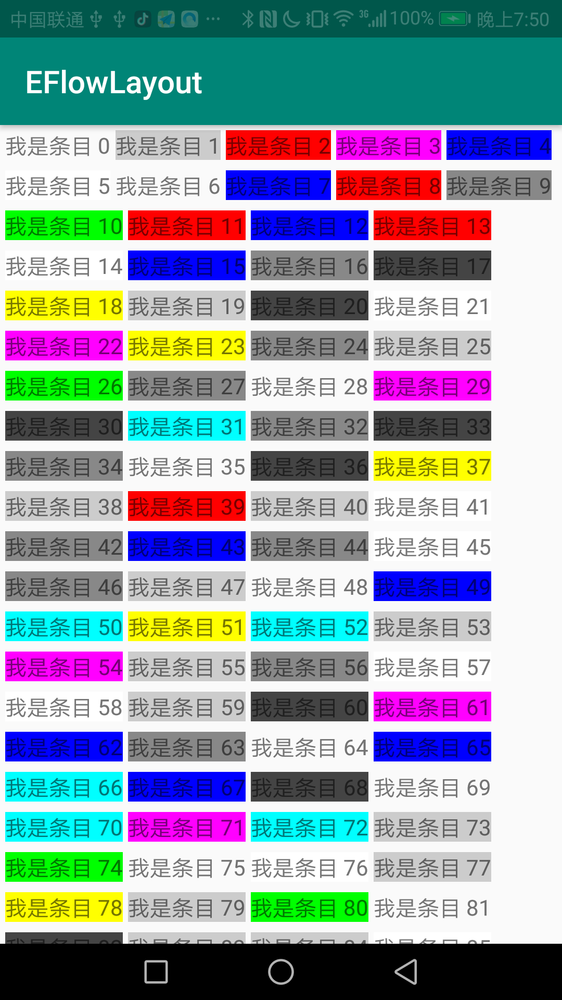

# EFlowLayout

超简单流式布局
效果图：

## 如何使用

1. 布局内引用

         <com.android.eflowlayout.EFlowLayout
                android:id="@+id/fl"
                android:layout_width="match_parent"
                android:layout_height="match_parent"/>

2. 添加条目view

        EFlowLayout viewById = (EFlowLayout) findViewById(R.id.fl);
        for (int i = 0; i < 1000; i++) {
            TextView textView = new TextView(MainActivity.this);
            textView.setText("我是条目 " + i);
            int i1 = new Random().nextInt(colors.length);
            textView.setBackgroundColor(colors[i1]);
            viewById.addView(textView);
        }

额外提供方法
设置子条目之间的间距问题

        viewById.setItemMargin(10, 10, 10, 10);

布局内字段名称，与上述方法同样效果

<table>
<tr>
<td>item_left_margin</td>
<td>条目的左边间距</td>
</tr>
<tr>
<td>item_right_margin</td>
<td>条目的右边间距</td>
</tr>
<tr>
<td>item_top_margin</td>
<td>条目的上边间距</td>
</tr>
<tr>
<td>item_bottom_margin</td>
<td>条目的下边间距</td>
</tr>
</table>

        <attr name="item_left_margin" format="dimension" />
        <attr name="item_right_margin" format="dimension" />
        <attr name="item_top_margin" format="dimension" />
        <attr name="item_bottom_margin" format="dimension" />